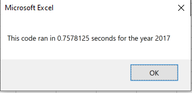
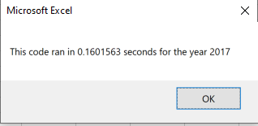
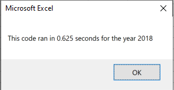
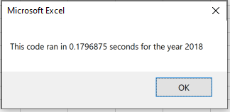

# VBA - Election Analysis

## Overview of the Project:
The overview of project was to refactor the code you had written for Steve. The prior code worked well, but why not try and make it more efficient! 
  * Fewer steps
  * Using less memory
  * Improving the logic of the code to make it easier for future users to read

## Results: 
### Using images and examples of your code, compare the stock performance between 2017 and 2018, as well as the execution times of the original script and the refactored script.

It was clearly a better year for stocks in 2017! All the stocks had a better performance in 2017 besides TERP. Hopefully they weighted their portfolio in ENPH and RUN in 2018, as these were the only stocks have a positive return for that year. 

#### Greenstock (2017)

#### Refactored (2017)

------------------------

#### Greenstock (2018)

#### Refactored (2018)

I was able to trim down certain code

#### Greenstock
               If Cells(j + 1, 1).Value <> ticker And Cells(j, 1).Value = ticker Then
               endingPrice = Cells(j, 6).Value

#### Refactored
               If Cells(i + 1, 1).Value <> tickers(tickerindex) Then
               tickerEndingPrices(tickerindex) = Cells(i, 6).Value

## Summary:
   * What are the advantages or disadvantages of refactoring code?
        1. The advantages of refactoring code is to create the code is fresher, easier to understand, less complex, and easier to maintain. 
        2. It can make the code more flexible, in the case that there are other variables that may need to be added ot the functions.
        3. The disadvantages of refactoring code is it is time consuming. You are attempting to alter a model that is already running somewhat efficiently. 
        4. You run the risk of trying to overcomplicate a solved issue.
   * How do these pros and cons apply to refactoring the original VBA script?
        1. I was able to run the code more efficiently which was one of the main goals of the project. We were tasked with not adding functionality but improving the logic.                  Obviously this being my first time with VBA - changing code that works is nerve racking. With this it becomes more of understanding the code rather than trying to jump in and change it.
